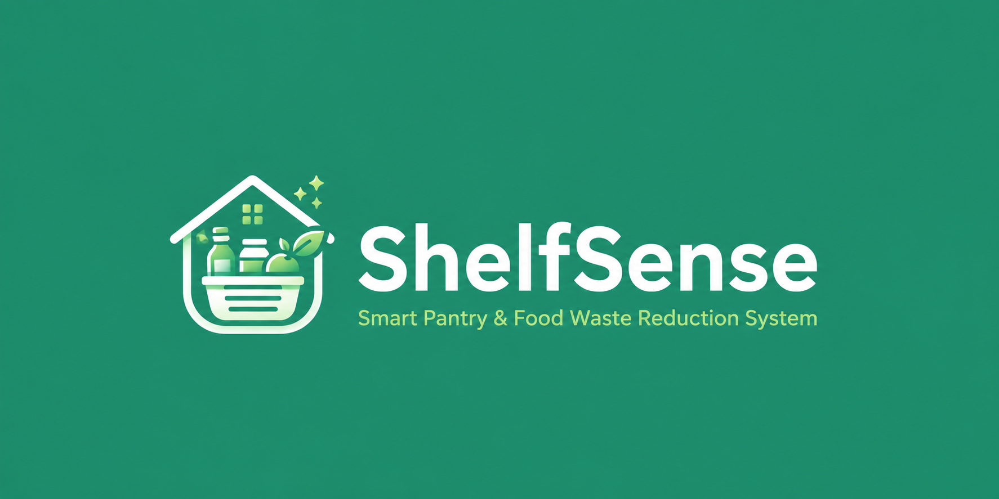
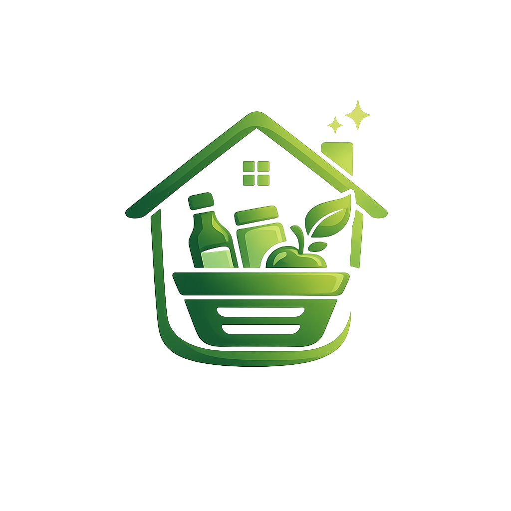
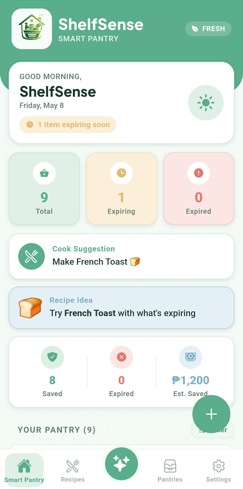
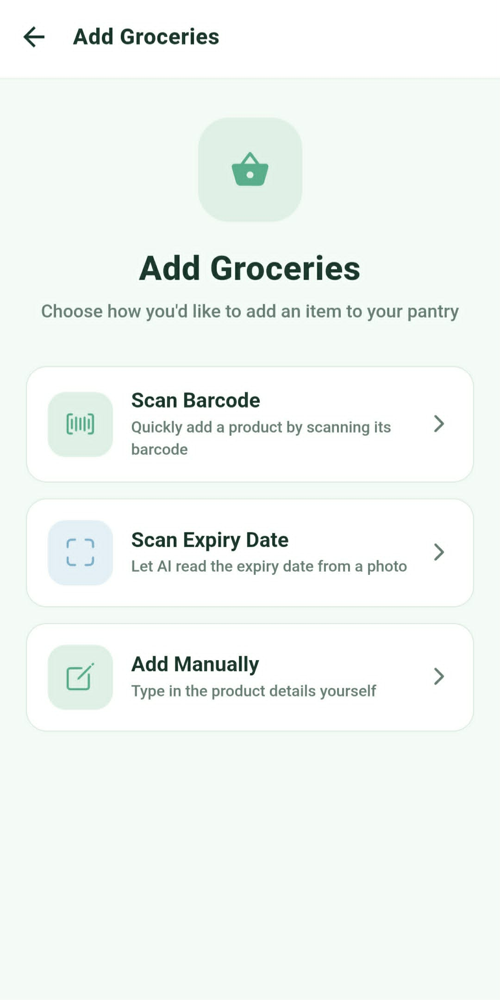
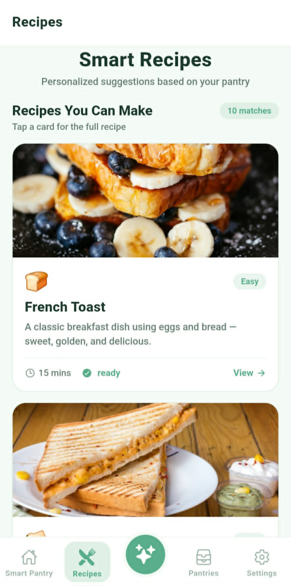
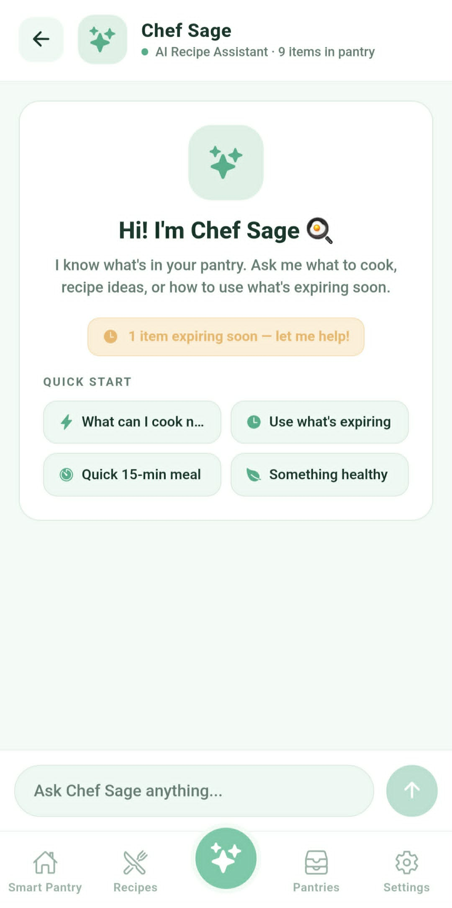

<div align="center">



<br />
<br />

#  ShelfSense

**Smart Pantry & Food Waste Reduction System**

*Stop forgetting. Start using. Waste less.*

<br />


<br />

[](/)
[](/)
[](https://shelf-sense-mu.vercel.app/)

</div>

---

> *"In the Philippines, plate waste has grown by 69% in just five years —*
> *not out of carelessness, but simply because we forget what's already there."*
>
> — **DOST-FNRI**, 2023 National Nutrition Survey

---

## 🚨 The Problem

Every day, **2,175 tons of food** are thrown away in Metro Manila alone —
while nearly **30% of Filipinos still go hungry**.

It doesn't start at the trash bin.
**It starts at home** — with food pushed to the back of the pantry,
expiration dates no one checked, and no idea what to cook with
what's already there.

<br />

<div align="center">

| 🏠 Household | 🏙️ Metro Manila | 🇵🇭 Philippines |
|:---:|:---:|:---:|
| **+69%** | **2,175 tons/day** | **2.95M tonnes/year** |
| rise in plate waste since 2018 | of food trashed daily | wasted nationwide |
| *DOST-FNRI, 2023* | *Barrion et al., 2023* | *UNEP 2024* |

</div>

---

## 😩 Sound Familiar?

You've probably been here before:

- 🧊 You open the fridge and find something expired — and you don't even remember buying it
- 🛒 You buy groceries, then realize you already have the same thing at home
- 😩 It's 7pm, you're hungry, and you have no idea what to cook with what's left
- 📦 Something gets pushed to the back of the shelf — and surfaces weeks later, too late

**ShelfSense was built for exactly those moments.**

---

## 🎬 Demo

<div align="center">

[](https://drive.google.com/drive/u/1/folders/1t0c3TO_0bKAZpu4aPH9vhOgoNIjnSH9d)
&nbsp;&nbsp;
[](https://shelf-sense-mu.vercel.app/)

*A quick walkthrough of scanning, smart recipes, and the AI Chef Assistant in action.*
*Or jump straight in — try the live web app above.*

</div>

---

## 📸 Screenshots

<div align="center">

| **Dashboard** | **AI Scanner** | **Smart Recipes** | **AI Chef Assistant** |
|:---:|:---:|:---:|:---:|
|  |  |  |  |

</div>

---

## ✨ Features

| Feature | Description |
|---|---|
| 📦 **Pantry at a glance** | See everything you have, what's expiring soon, and what to use first |
| 📷 **Barcode & expiry scanning** | Scan barcodes or let AI read expiry dates — even when labels are worn or unclear |
| 🍳 **Smart recipe suggestions** | Get recipe ideas built around what you already have, prioritizing near-expiry items |
| 🤖 **AI Chef Assistant** | Ask *"what can I cook tonight?"* and get personalized answers based on your actual pantry |
| 🔔 **Expiry alerts** | Get notified before food goes bad so you can act on it, not throw it out |
| 📱 **Works everywhere** | Available on iOS, Android, and as a Web PWA — one app, all platforms |

---

## 🧠 How It Works

ShelfSense turns your pantry into a self-aware system in four simple steps:

<div align="center">

**📷 Scan → 📦 Track → 🔔 Alert → 🍳 Cook**

</div>

<br />

1. **📷 Scan** — Point your camera at a barcode or expiry date. Gemini reads even faded, blurry, or worn-out labels.
2. **📦 Track** — Items are added to your pantry automatically — quantity, expiry, and category, all auto-filled.
3. **🔔 Alert** — As food approaches expiry, ShelfSense surfaces it on your dashboard *before* it's too late.
4. **🍳 Cook** — Ask the AI Chef Assistant *"what can I make tonight?"* and get recipes built around what you actually have.

> **The result:** less waste, less guesswork, less spending.

---

## 🏆 Why ShelfSense?

There are recipe apps. There are grocery trackers. **ShelfSense is the awareness layer between your pantry and your plate.**

<div align="center">

| | 📝 Sticky Notes | 🍳 Recipe Apps | 📊 Spreadsheets | 💚 **ShelfSense** |
|---|:---:|:---:|:---:|:---:|
| Knows what's in your pantry | ❌ | ❌ | ⚠️ Manual | ✅ |
| Reads expiry dates from labels | ❌ | ❌ | ❌ | ✅ AI-powered |
| Suggests recipes from *your* food | ❌ | ❌ | ❌ | ✅ |
| Alerts before food expires | ❌ | ❌ | ❌ | ✅ |
| Personalized AI assistant | ❌ | ❌ | ❌ | ✅ |
| Works offline | ⚠️ | ⚠️ | ✅ | ✅ |

</div>

Other tools help you *cook* or *list*. ShelfSense helps you **remember, plan, and decide** — so nothing in your kitchen gets forgotten.

---

## 👥 Who This Is For

> For the **college student** living alone, juggling deadlines and groceries.
> For the **parent** trying to stretch the family budget a little further.
> For the **working professional** who meal preps but forgets what's in the fridge.
> For anyone who has ever opened their pantry and asked —
> *"Wait, when did I buy this?"*

---

## 🛠️ Tech Stack

ShelfSense is a cross-platform mobile and web app built with modern tools:

### 📱 App Framework
| Tool | Purpose |
|---|---|
| **Expo + React Native** | Build one app that runs on iOS, Android, and Web |
| **React Navigation v7** | Screen navigation with tabs and stacks |
| **Plus Jakarta Sans** | Clean, modern font across the app |

### 🤖 AI & Scanning
| Tool | Purpose |
|---|---|
| **Google Gemini** | Powers the AI Chef Assistant and reads expiry dates from camera images |
| **expo-camera** | Native barcode and expiry date scanning on mobile |
| **html5-qrcode** | Barcode scanning on the web version |

### 🗄️ Storage & Database
| Tool | Purpose |
|---|---|
| **Firebase** | Cloud database and backend — stores pantry data across devices |
| **Upstash** | Fast Redis-style database for server-side operations |
| **AsyncStorage** | Keeps data available offline on the user's device |

### 🔐 Auth & Security
| Tool | Purpose |
|---|---|
| **JWT (jsonwebtoken)** | Secure token-based login sessions |
| **bcryptjs** | Hashes and protects user passwords |

### 🚀 Deployment
| Tool | Purpose |
|---|---|
| **Vercel** | Hosts the web app and serverless API functions |
| **Expo Export** | Builds and packages the app for all platforms |

### 🧰 Utilities
`date-fns` — date formatting and expiry calculations &nbsp;|&nbsp; `uuid` — unique IDs for pantry items

---

## 🚀 Getting Started

### Prerequisites
- Node.js `v18+`
- Expo CLI — `npm install -g expo-cli`
- A `.env` file based on `.env.example`

### Installation

```bash
# Clone the repository
git clone https://github.com/Vallywi/ShelfSense.git
cd ShelfSense

# Install dependencies
npm install

# Set up environment variables
cp .env.example .env
# Fill in your own API keys

# Start the app
npx expo start

# Run the API server (separate terminal)
npm run api
```

---

## 💚 The Bottom Line

Food waste is not a trash problem. **It's an awareness problem.**

> *Food waste doesn't start at the trash bin.*
> *It starts the moment we stop paying attention.*
> **ShelfSense gives that attention back — one pantry at a time.**

---

<div align="center">

Made with 💚 for Filipino households &nbsp;·&nbsp; <i>Byte Me </i> &nbsp;·&nbsp; Devkada 2026

</div>
